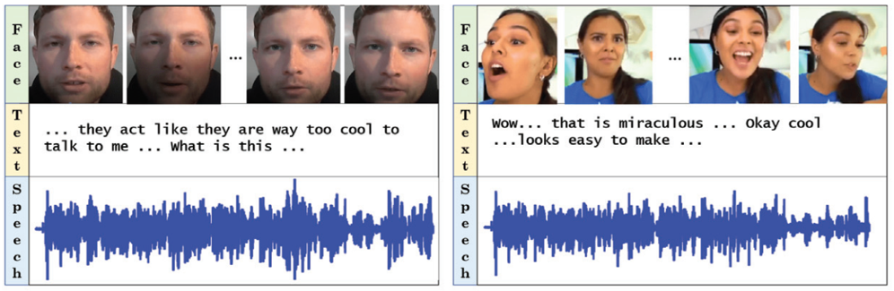
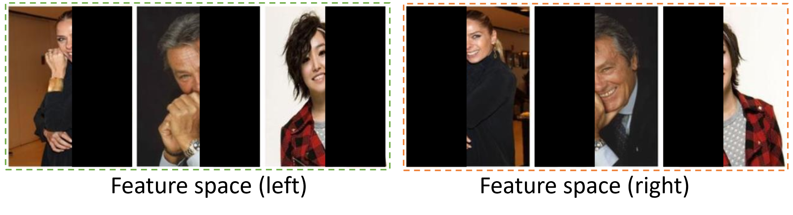

# PMSL
research proj. You are also welcome to share your ideas by opening an issue or dropping me an email at [pengy1@ufl.edu](mailto:pengy1@ufl.edu). 

Dataset:
(1) IEMOCAP (modality: audio, text, and video). You can access the IEMOCAP data [here](https://sail.usc.edu/iemocap/). Utility label: Positive/Negative. Privacy label: Male/Female. 

(2) CelebA (16x32, 16x32). You can access the CelebA data [here](https://mmlab.ie.cuhk.edu.hk/projects/CelebA.html) Utility label: Smiling or not. Privacy label: Male or not. 

(3) LFW. You can access the LFW data [here](https://vis-www.cs.umass.edu/lfw/)
